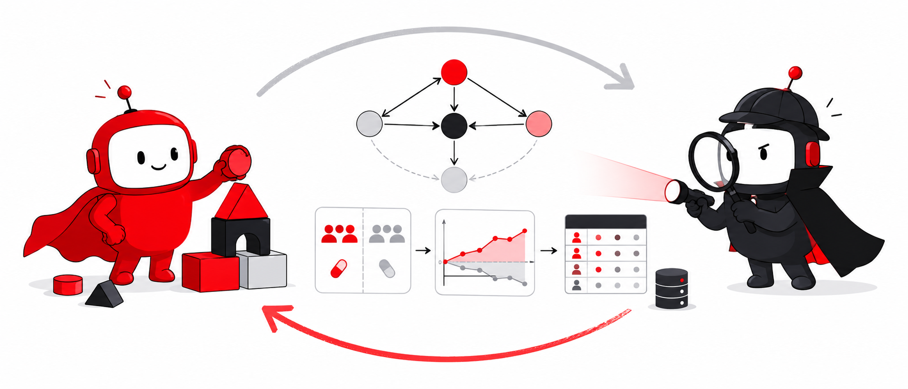

# Observational Causal Inference (OCI) Agent



*See our [blog post](https://medium.com/@netflixtechblog/4623f0a9c5af) for more context and motivation.*

> [!WARNING]
> This repository is a **Netflix Skunkworks project** containing a **standalone version of our oci-agent** so that OCI practitioners can review the approach, model their workflows on it, and suggest improvements.
> 
> **Use with eyes open.** This is an ongoing research effort, not a production‑grade tool. Expect rough edges:
> * **No warranty; provided "AS IS."** The code is provided without warranties or conditions of any kind, express or implied, including but not limited to merchantability, fitness for a particular purpose, title, non‑infringement, security, accuracy, or error‑free operation. You use it at your own risk.
> * **No guarantees on behavior or coverage.** It is a reference implementation only. It may have unknown coverage gaps, false positives/negatives, and environment‑specific issues. It is not a replacement for your own design, review, testing, and validation.
> * **No liability.** To the maximum extent permitted by law, Netflix will not be liable for any damages or losses arising from or related to your use of this repository or the code, whether direct or indirect, even if advised of the possibility of such damages. By using this repository, you accept full responsibility and risk for your use and any outcomes that result.
>
> *Status, Maintenance, and Contributions*
> * **No maintenance commitment.** Netflix does not commit to maintaining, updating, or expanding this project. It may change, be archived, or be removed at any time without notice.
> * **No pull requests.** We are not accepting PRs or external code contributions for this repository.
> * **Feedback welcome via Issues.** We do welcome feedback, bug reports, and design suggestions via the GitHub Issues tab, especially around how you model your workflows on this code and how the approach could be improved.

Parameterizes and executes Jupyter notebooks that estimate causal effects from
observational data, then writes actor-critic reports and suggests next steps.

The pipeline is structured as a loop:

```
plan → actor.draft → spec → nb_runner → results.json → critic.evaluate → oci_report.md
                       ↑                                                       │
                       └─── actor.revise ◀──────────── critique.json ◀─────────┘
```

The **actor** (`oci_agent/actor.py`) translates plans into specs and applies
critic suggestions on each iteration. The **runner** (`oci_agent/nb_runner.py`)
injects spec parameters into a notebook's configuration cell, executes the
notebook, and appends a results-serialization cell. The **critic**
(`oci_agent/critic.py`) reviews `results.json` against the writing-reports
skill and emits a three-tier verdict (`fully_satisfactory` /
`satisfactory_with_caveats` / `not_satisfactory`) plus concrete spec changes.

## Quick start

### 1. Install

Python 3.10+ is required (`numpy<2` is pinned because `econml`'s transitive
`shap` references the removed `np.bool8` in numpy ≥ 2.0). If your system
`python3` is older, invoke `venv` with a newer interpreter explicitly
(e.g. `python3.12 -m venv ...`).

```bash
python3 -m venv .venv && source .venv/bin/activate
pip install -e .
```

The actor and critic call the Anthropic Messages API. Set an API key
before invoking any subcommand that hits the model (`draft`, `evaluate`,
`revise`, and the LLM judge mode of `evals/smoketest/judge.py`):

```bash
export ANTHROPIC_API_KEY=sk-ant-...
```

To route through an Anthropic-compatible proxy instead of the public API,
also set `ANTHROPIC_BASE_URL`.

### 2. Try it out (one synthetic dataset, ~30 seconds)

The repo does not ship the ACIC 2016 release. For a quick end-to-end smoke,
generate one ACIC-shaped dataset under `evals/acic2016/`:

```bash
python evals/generate_synthetic_acic.py
```

Running this command on an already-populated `eval_datasets/acic2016/`
directory is refused by default — pass `--force` if you really want to
overwrite (this guards the real ACIC 2016 bundle from being silently
replaced with synthetic data, which would leave the response files
inconsistent with `x.csv`).

Then drive the actor-critic loop one step at a time against the
`plans/tryitout.md` plan (anchored on that single dataset):

```bash
oci-agent draft    --plan plans/tryitout.md      --specs-dir specs
oci-agent run      specs/tryitout/iter_01.yaml   --output-dir output/tryitout
oci-agent evaluate output/tryitout               --plan plans/tryitout.md
oci-agent revise   output/tryitout               --specs-dir specs/tryitout
```

To run a second iteration, point `run` at the revised spec and re-run
`evaluate` / `revise`. The CLI auto-increments the output directory
(`output/tryitout/iter_02/`, ...) and spec filename (`iter_03.yaml`, ...)
each time, so you never need to track the iteration counter yourself:

```bash
oci-agent run      specs/tryitout/iter_02.yaml   --output-dir output/tryitout
oci-agent evaluate output/tryitout               --plan plans/tryitout.md
oci-agent revise   output/tryitout               --specs-dir specs/tryitout
```

Repeat with `iter_03.yaml`, `iter_04.yaml`, ... for further iterations.

Or drive the full loop in one command (prompts between iterations; default 1):

```bash
oci-agent loop specs/tryitout/iter_01.yaml \
    --output-dir output/tryitout --specs-dir specs/tryitout \
    --plan plans/tryitout.md --iterations 1
```

### 3. Smoketest battery (77 synthetic DGPs × K responses)

If you don't already have the ACIC 2016 release staged, you can generate a
full synthetic battery first (~140 MB on disk, a few seconds to write). Better
yet, you can download the real ACIC 2016 data following the instructions in SETUP.md
Then run the orchestrator, evaluator, judge, and benchmark plot:

```bash
python evals/generate_synthetic_acic.py --treatments 1-77 --responses-per-treatment 5
python -m evals.smoketest.run --k 3                 # config: configs/smoketest.yaml
python -m evals.smoketest.eval                      # bias / RMSE / coverage / width
python -m evals.smoketest.judge --judge-mode deterministic
python -m evals.smoketest.plot                     # writes evals/smoketest/benchmark_plot.png
```

Add the LLM judge alongside the deterministic one with
`--judge-mode both` (uses the Anthropic client; same key resolution as
the actor/critic). To reproduce against the **official** ACIC 2016
release (~2.5 GB) instead of the synthetic suite, follow [SETUP.md](SETUP.md)
to stage the data under `eval_datasets/acic2016/` and skip the
`generate_synthetic_acic.py` step above — everything downstream is identical.

### 4. Scaffolded vs unscaffolded LLM head-to-head

Assumes the smoketest battery from step 3 has been generated *or* the
official ACIC data has been downloaded (the script samples random
`(acic_treatment, acic_response)` pairs from `evals/acic2016/`).
`--n-studies 1` runs a single dataset in ~3 min; `--n-studies 10`
reproduces the aggregate headline below (~30 min sequential):

```bash
python -m evals.baseline_vs_scaffolded.run --seed 42                # one study
python -m evals.baseline_vs_scaffolded.run --seed 42 --n-studies 10 # full headline
```

Both paths receive the *identical* rendered plan from
`plans/baseline_vs_scaffolded.md`; Path A runs the full actor-critic
loop, Path B is a single Sonnet 4.6 call with no tools or skills.

## Repository layout

| Path | Contents |
|---|---|
| `oci_agent/`        | Installable Python package: actor, critic, runner, CLI (`oci_agent.agent`), and backend helpers (`oci_agent.backends.{econml,utils,estimators}`) |
| `notebooks/`        | Analysis notebooks (e.g. `econml.ipynb`). Notebook code imports backends from the installed `oci_agent.backends` package — no sys.path gymnastics |
| `pyproject.toml`    | Package metadata + dependencies (`pip install -e .`) |
| `skills/`           | Skill markdown the actor and critic load at runtime: `writing-specs`, `changing-notebooks`, `running-notebooks`, `writing-reports`, `suggesting-remedies` |
| `configs/`          | YAML config for the smoketest (`smoketest.yaml`) and XGBoost hyperparams (`xgboost.yaml`) |
| `plans/`            | Pre-analysis plans (markdown) — input to `actor.draft` |
| `specs/`            | Generated and revised specs (`specs/{plan}/iter_NN.yaml`) |
| `output/`           | Per-run artifacts: `spec.yaml`, `results.json`, executed `.ipynb`, `oci_report.md`, `critique.json` |
| `evals/`            | Two evaluation suites: `evals/smoketest/` (77-DGP ACIC 2016 battery + judge + benchmark plots) and `evals/baseline_vs_scaffolded/` (scaffolded vs unscaffolded LLM head-to-head). See `evals/README.md` for the index. |
| `eval_datasets/`    | ACIC 2016 datasets — gitignored; fetched separately (see [SETUP.md](SETUP.md)) or generated synthetically. Symlinked at `evals/acic2016/` |
| `examples/`         | Example spec (`eval_spec.yaml`) |
| `CLAUDE.md`         | Repo-level instructions for Claude when editing this codebase |
| `SETUP.md`          | Environment setup (notebook venv, agent venv, API key) |

## Smoketest results at a glance

231 ACIC 2016 datasets (3 responses sampled per treatment, K=3 / seed 42),
DRLearner with cross-fitted XGBoost nuisances, AIPW pseudo-outcome for
variance. With 95% CIs from `±1.96·std/√N` (bootstrap for RMSE):

| Estimand | \|Bias\| | RMSE | Cov95 |
|---|---|---|---|
| ATE | 0.015 | 0.173 | 84.8% |
| ATT | 0.017 | 0.083 | 96.1% |
| ATO | 0.014 | 0.066 | 97.0% |

Our **ATT** ranks **5th of 16 by |bias|** (only BART, calCause, H2O
Ensemble, and TMLE are closer to zero) and **9th of 16** on RMSE against
the ACIC 2016 black-box benchmark — between the LASSO+CBPS tier above
(RMSE 0.05–0.08) and the CBPS / `teffects` tier below (RMSE 0.11). The
Critic emits an **independent verdict per estimand**; on the K=3 batch,
the agentic Claude Haiku judge agrees with the deterministic decision
rules on **666/693 (96%)** of run × estimand records.

See `evals/README.md` for the full write-up, the coverage-vs-RMSE
benchmark plot, the deterministic × LLM confusion matrix, and the
per-tier contrast tables. The companion `evals/smoketest/judge_ate_plot.png` shows
how cleanly the judge tier separates the ATE runs.

### Scaffolded vs unscaffolded comparison

Across 10 randomly-sampled ACIC datasets (`--seed 42 --n-studies 10`),
the full actor-critic loop produces calibrated ATT estimates: mean
|error| = 0.054, RMSE = 0.064, and the 95% CI covers truth in **9/10**
runs (mean interval width 0.35). The same Sonnet 4.6 model given only
the plan text and a 5-row data head, with no tools or skills, has mean
|error| = 2.572 (~48× worse), RMSE = 3.260, and covers truth in only
**3/10** (mean interval width 1.48 — wider, but still missing). The
contrast is visible in `evals/baseline_vs_scaffolded/plot.png`.
Reproduce with `python -m evals.baseline_vs_scaffolded.run --seed 42 --n-studies 10`.

## Known limitations

- **Python 3.10+ only.** `numpy<2` is pinned because `econml`'s transitive
  `shap` dependency references the removed `np.bool8`.
- **CPU-only XGBoost.** Hyperparameters live in `configs/xgboost.yaml`; a
  GPU build of XGBoost would work but is not wired up.
- **One analysis notebook.** `notebooks/econml.ipynb` is the only estimator
  shipped — it's an EconML DRLearner with cross-fitted XGBoost nuisances.
  Other estimators (CausalForest, doubly-robust IPW, BART, ...) would need
  a new notebook and a small spec change.
- **ACIC 2016 schema.** The notebook expects `evals/acic2016/x.csv` plus
  `evals/acic2016/<treatment>/zymu_<response>.csv` with columns
  `z, y0, y1, mu0, mu1`. Other datasets need a different loader.
- **Anthropic API required.** Actor / Critic / baseline path call the
  Claude Messages API; set `ANTHROPIC_API_KEY` (and optionally
  `ANTHROPIC_BASE_URL` to route through a proxy).
- **No maintenance commitment.** This is a Skunkworks reference release;
  feedback via Issues is welcome but PRs are not accepted.
